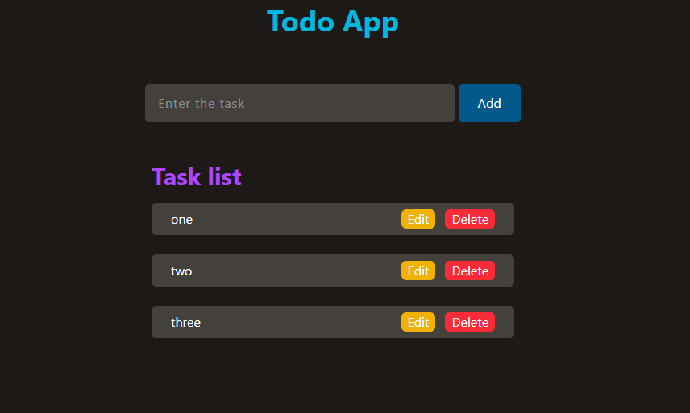

# Todo App

A simple and responsive Todo App built using HTML, Tailwind CSS, and JavaScript.

## Features

- Add tasks
- Edit tasks
- Delete tasks
- Responsive UI
- Dark theme design

## Technologies Used

- HTML
- Tailwind CSS
- JavaScript

## Project Structure

```bash
├── index.html
├── class.js
└── README.md
```

## Screenshot



## How to Run

1. Clone the repository

```bash
git clone <https://github.com/achu19desg/ToDo.git>
```

2. Open the project folder

3. Run `class.html` using Live Server

## Functionality

### Add Task
Users can add new tasks using the input field.

### Edit Task
Users can edit existing tasks using the Edit button.

### Delete Task
Users can remove tasks using the Delete button.
